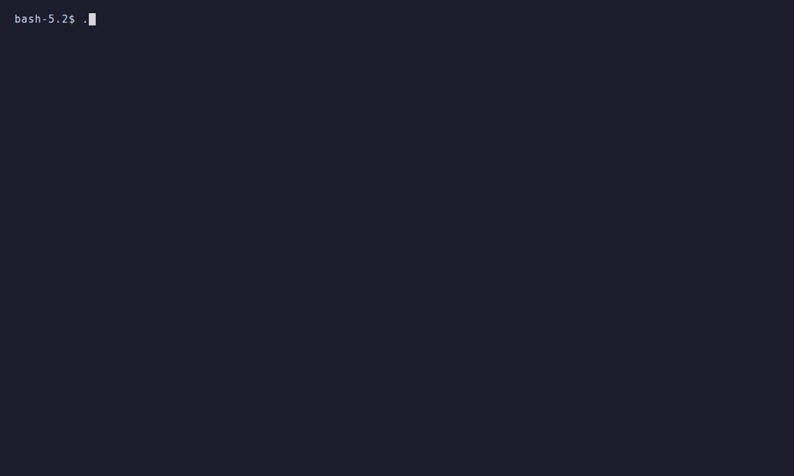
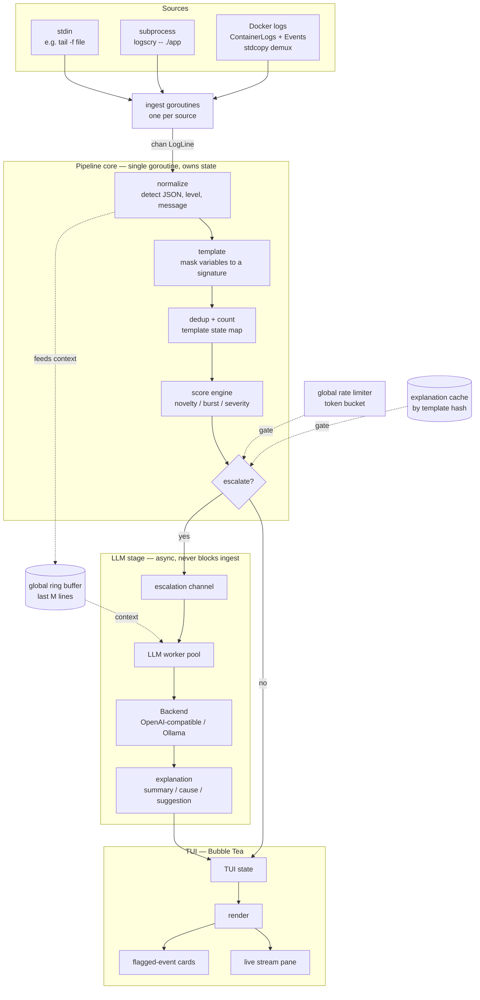

# logscry

**Real-time, AI-assisted log triage. Silent on noise, speaks on signal.**

logscry tails a log or event stream as it happens, does cheap local scoring to tell
routine noise from genuine anomalies, and escalates **only** the anomalies to an LLM for
a short, structured explanation — while staying quiet on everything else.

## Demo



> _The GIF is added separately — see [RECORDING.md](RECORDING.md). To watch it live in
> ~30 seconds, run the [demo compose](examples/demo)._

Healthy traffic scrolls on the left. One real fault — a worker that can't reach Postgres
— escalates and lands as an explained card on the right, while the routine chatter around
it stays unremarked.

## What it is

logscry is a single-binary CLI/TUI for **dev-time log triage**. Point it at a running
local stack — a piped log file, a subprocess, or your Docker containers — and it watches
the stream in real time. Most log lines are routine; logscry collapses them into
templates and scores them locally. When something is genuinely novel, bursting, or
fatal, it sends that one event (with surrounding context) to an LLM and shows you a
concise **what happened / likely cause / what to check** card.

It is **not** an "LLM observability" product (those monitor AI applications — prompts,
tokens, output quality). It is the inverse: an LLM used as a tool to make *any* system's
logs understandable.

## How it's different

- **Real-time / streaming-native** — a live tail that flags anomalies as they appear, not
  a scan-on-demand report you run after the fact.
- **Source-agnostic** — stdin, a subprocess, or Docker containers in v1 (NATS/Kafka/
  journald later). Not tied to Kubernetes.
- **Local-first** — runs offline against a local [Ollama](https://ollama.com); your logs
  stay on your machine. No cluster, no SaaS, no account.

The closest comparable, [k8sgpt](https://github.com/k8sgpt-ai/k8sgpt), proves the demand
for AI-explained errors but is Kubernetes-specific and scan-based. logscry deliberately
takes the real-time, source-agnostic, dev-time lane it leaves open.

## Quick start

```sh
# build the single binary -> ./bin/logscry
make build

# follow all Docker containers, auto-attaching to new ones
./bin/logscry --docker-all

# run a program and watch its stdout+stderr
./bin/logscry -- ./myapp

# tail a log file (keys come from /dev/tty, so stdin stays free for logs)
tail -f /var/log/app.log | ./bin/logscry

# see what WOULD escalate without calling an LLM (no model needed)
./bin/logscry --docker-all --explain-dry-run
```

Explanations use a local Ollama by default (`http://localhost:11434/v1`). Pull a model
and go:

```sh
ollama pull gemma2:2b
./bin/logscry --docker-all --llm-model gemma2:2b
```

Point it at any OpenAI-compatible endpoint (OpenAI, Groq, …) with `--llm-url` and
`--llm-model`; the API key comes from the environment, never a flag or the config file:

```sh
export LOGSCRY_API_KEY=sk-...
./bin/logscry --docker-all \
  --llm-url https://api.openai.com/v1 --llm-model gpt-4o-mini
```

In the TUI: `Tab` moves focus between the two panes, `Enter` expands the selected card,
`t` toggles the live stream against the aggregated template table, `p` pauses rendering
while ingestion continues, and `q` quits. logscry falls back to plain line output on its
own when stdout is not a terminal, so piping and redirecting never see escape codes
(force it with `--plain`).

The fastest way to see all of this is the **[demo](examples/demo)**: one
`docker compose up` and one `logscry --docker-all`.

## How it works



You can't call an LLM on every log line in real time — cost, latency, and noise all
forbid it. The interesting part is the pipeline that avoids doing so:

1. **Normalize** each line (JSON or plain text) into a level and a message.
2. **Template** it — mask the variable parts (`<NUM>`, `<IP>`, `<UUID>`, …) down to a
   signature, so `user 4821 failed` and `user 9933 failed` become one pattern.
3. **Dedup and count** by that signature, tracking first/last seen and recent rate.
4. **Score** it from independent signals — **novelty** (unseen, or unseen past a
   cooloff), **burst** (rate spiking above the template's own baseline), and **severity**
   (stderr / `ERROR|FATAL|PANIC|CRITICAL`).

Only events at or above the threshold escalate — and even then only if they aren't
already explained (an **explanation cache** keyed by template hash) and a **global rate
limiter** allows it. That token bucket caps LLM calls per minute *regardless of log
volume*, so cost is bounded no matter how loud the stream gets. The LLM stage is an async
worker pool: a slow or dead model degrades one card to "explanation unavailable" and
never stalls the tail.

The design bias is deliberate: **fewer, higher-confidence escalations.** A tool that
cries wolf gets uninstalled after a day.

## Configuration

Everything common is a flag; `--config logscry.yaml` covers the full set; the one secret
(`LOGSCRY_API_KEY`) is environment-only. Precedence is defaults < file < flags.

Key flags:

| Flag | Default | What it does |
|---|---|---|
| `--docker-all` | off | Follow all Docker containers, auto-attaching to new ones |
| `--docker-name <re>` | — | Follow containers whose name matches a regexp |
| `--docker-tail <n>` | `100` | Lines of history fetched per container on attach (`all` for everything) |
| `--llm-url <url>` | local Ollama | OpenAI-compatible base URL |
| `--llm-model <name>` | `gemma2:2b` | Model to ask for explanations (`ollama pull gemma2:2b`) |
| `--llm-max-tokens <n>` | `300` | Cap on tokens per explanation |
| `--threshold <f>` | `1.0` | Escalate at or above this score |
| `--rate-limit <n>` | `10` | Global cap on LLM calls per minute (the cost cap) |
| `--explain-dry-run` | off | Show what *would* escalate; build no LLM stage at all |
| `--plain` | auto | Plain line output instead of the TUI |
| `--version` | — | Print the version and exit |

`--explain-dry-run` is the way to calibrate thresholds and to run in CI: it surfaces
every would-be escalation and, crucially, builds no backend and no worker pool — so no
request *can* be made.

**Reasoning models need more `--llm-max-tokens`.** A thinking model (e.g. `qwen3`,
`deepseek-r1`) can spend the whole default 300-token budget on its chain of thought and
return **empty** content with `finish_reason: length` — the escalation shows as
unavailable rather than explained. Raise `--llm-max-tokens` (say `1024`) for such models.
Non-reasoning instruct models like the default `gemma2:2b` are fine at 300.

A full annotated config lives at [`examples/logscry.yaml`](examples/logscry.yaml). Run
`./bin/logscry -h` for every flag.

## Known limitations (v1)

- **Multi-line grouping is heuristic.** logscry folds stack traces and goroutine dumps
  into one event before templating — Python, Java, and Go traces each collapse to a
  single template, so a traceback no longer explodes into dozens of "novel" frames. The
  heuristic (indentation, frame markers, language cues) errs toward under-grouping, so an
  unusual continuation style may still split. A buffered event is flushed after
  `--group-timeout` (`group.timeout`, default `200ms`) of idle; set it to `0` to disable
  grouping entirely.
- **`--docker-tail` defaults to 100 lines** of history per container on attach. An event
  further back than that won't appear until it recurs — use `--docker-tail all` for the
  full backlog.
- **Reasoning models need a higher `--llm-max-tokens`.** A thinking model (e.g. `qwen3`,
  `deepseek-r1`) can spend the whole default budget on its chain of thought and return
  empty content with `finish_reason: length`. Prefer a plain instruct model such as
  `gemma2:2b`, or raise the cap (see [Configuration](#configuration)).

## License

[Apache-2.0](LICENSE). See also [NOTICE](NOTICE).

Contributions are welcome — see [CONTRIBUTING.md](CONTRIBUTING.md).
