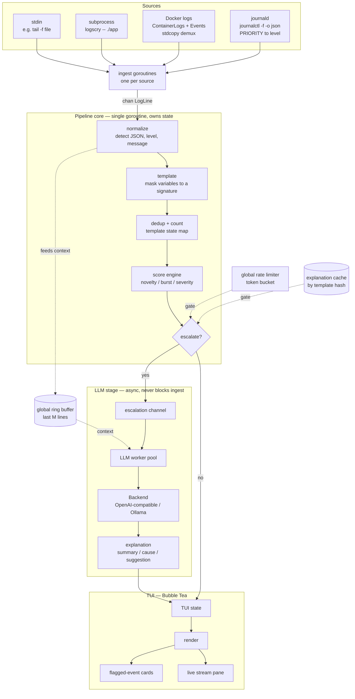

<p align="center">
  <picture>
    <source media="(prefers-color-scheme: dark)" srcset="docs/logo-dark.svg">
    
  </picture>
</p>

# logscry

<p align="center">
  
  
  <a href="https://github.com/maxie7/logscry/releases/latest"></a>
  <a href="https://github.com/maxie7/logscry/actions/workflows/ci.yml"></a>
  <a href="https://codecov.io/gh/maxie7/logscry"></a>
  
  
</p>

**Real-time, AI-assisted log triage. Silent on noise, speaks on signal.**

logscry tails a log or event stream as it happens, does cheap local scoring to tell
routine noise from genuine anomalies, and escalates **only** the anomalies to an LLM for
a short, structured explanation — while staying quiet on everything else.

## Demo


> _The GIF is added separately — see [RECORDING.md](RECORDING.md). To watch it live in
> ~30 seconds, run the [demo compose](examples/demo)._

Healthy traffic scrolls on the left. One real fault — a worker that can't reach Postgres
— escalates and lands as an explained card on the right, while the routine chatter around
it stays unremarked.

## What it is

logscry is a single-binary CLI/TUI for **dev-time log triage**. Point it at a running
local stack — a piped log file, a subprocess, or your Docker containers — and it watches
the stream in real time. Most log lines are routine; logscry collapses them into
templates and scores them locally. When something is genuinely novel, bursting, or
fatal, it sends that one event (with surrounding context) to an LLM and shows you a
concise **what happened / likely cause / what to check** card.

It is **not** an "LLM observability" product (those monitor AI applications — prompts,
tokens, output quality). It is the inverse: an LLM used as a tool to make *any* system's
logs understandable.

## How it's different

- **Real-time / streaming-native** — a live tail that flags anomalies as they appear, not
  a scan-on-demand report you run after the fact.
- **Source-agnostic** — stdin, a subprocess, Docker containers, or the systemd journal
  (NATS/Kafka later). Not tied to Kubernetes.
- **Local-first** — runs offline against a local [Ollama](https://ollama.com); your logs
  stay on your machine. No cluster, no SaaS, no account.

The closest comparable, [k8sgpt](https://github.com/k8sgpt-ai/k8sgpt), proves the demand
for AI-explained errors but is Kubernetes-specific and scan-based. logscry deliberately
takes the real-time, source-agnostic, dev-time lane it leaves open.

## Installation

**Download a binary** — no Go toolchain needed. Grab the archive for your OS and
architecture from the [latest release](https://github.com/maxie7/logscry/releases/latest)
and put `logscry` on your `PATH`:

```sh
VERSION=0.8.0   # the version on the releases page, without the leading v
ARCHIVE=logscry_${VERSION}_linux_amd64.tar.gz   # or darwin_arm64, linux_arm64, …

curl -sSLO "https://github.com/maxie7/logscry/releases/download/v${VERSION}/${ARCHIVE}"
tar xzf "$ARCHIVE" logscry
chmod +x logscry
./logscry --version
```

Windows archives are `.zip`; macOS and Linux are `.tar.gz`. Every release also carries a
`checksums.txt`. Optionally confirm a download really came from this repo's release
pipeline — the archives ship with keyless GitHub build provenance:
`gh attestation verify "$ARCHIVE" --repo maxie7/logscry`.

**With Go** — if you already have a toolchain:

```sh
go install github.com/maxie7/logscry/cmd/logscry@latest
```

**From source** — for contributors, or to build a specific commit:

```sh
git clone https://github.com/maxie7/logscry.git && cd logscry
make build          # -> ./bin/logscry
```

## Quick start

The examples below use `./bin/logscry` (the from-source path); a downloaded or `go
install`ed binary is just `logscry`.

```sh
# build the single binary -> ./bin/logscry
make build

# follow all Docker containers, auto-attaching to new ones
./bin/logscry --docker-all

# run a program and watch its stdout+stderr
./bin/logscry -- ./myapp

# tail a log file (keys come from /dev/tty, so stdin stays free for logs)
tail -f /var/log/app.log | ./bin/logscry

# follow the systemd journal (Linux; see the note below on journal access)
./bin/logscry --journald

# ...or just some units, at warning and above
./bin/logscry --journald-unit nginx --journald-unit sshd --journald-priority 4

# see what WOULD escalate without calling an LLM (no model needed)
./bin/logscry --docker-all --explain-dry-run
```

Explanations use a local Ollama by default (`http://localhost:11434/v1`). Pull a model
and go:

```sh
ollama pull gemma2:2b
./bin/logscry --docker-all --llm-model gemma2:2b
```

Point it at any OpenAI-compatible endpoint (OpenAI, Groq, …) with `--llm-url` and
`--llm-model`; the API key comes from the environment, never a flag or the config file:

```sh
export LOGSCRY_API_KEY=sk-...
./bin/logscry --docker-all \
  --llm-url https://api.openai.com/v1 --llm-model gpt-4o-mini
```

In the TUI: `Tab` moves focus between the two panes, `Enter` expands the selected card,
`t` toggles the live stream against the aggregated template table, `p` pauses rendering
while ingestion continues, and `q` quits. logscry falls back to plain line output on its
own when stdout is not a terminal, so piping and redirecting never see escape codes
(force it with `--plain`).

The fastest way to see all of this is the **[demo](examples/demo)**: one
`docker compose up` and one `logscry --docker-all`.

## How it works



You can't call an LLM on every log line in real time — cost, latency, and noise all
forbid it. The interesting part is the pipeline that avoids doing so:

1. **Normalize** each line (JSON or plain text) into a level and a message.
2. **Template** it — mask the variable parts (`<NUM>`, `<IP>`, `<UUID>`, …) down to a
   signature, so `user 4821 failed` and `user 9933 failed` become one pattern.
3. **Dedup and count** by that signature, tracking first/last seen and recent rate.
4. **Score** it from independent signals — **novelty** (unseen, or unseen past a
   cooloff), **burst** (rate spiking above the template's own baseline), and **severity**
   (stderr / `ERROR|FATAL|PANIC|CRITICAL`).

Most of those signals are **boosters, not triggers**: they are weighted *below* the
threshold, so they raise a score without crossing it on their own. Only a burst and a
fatal-class level fire by themselves. That distinction is the whole calibration:

| | score | escalates? |
|---|---|---|
| A template nobody has seen before | 0.45 | no — a working host emits new benign templates all day |
| Routine `stderr` + `ERROR` chatter | 0.90 | no |
| A new template, at `WARN`, on stderr | 0.95 | no — the loudest a merely-*new* line gets |
| **A new template at `ERROR`** | **1.05** | **yes** — a new *failure* is the real signal |
| A template running at 5× its own baseline | 1.00 | yes |
| `FATAL` / `PANIC` | 1.00 | yes — even during warmup |

Every number is a knob (`--weight-novelty`, `--threshold`, or the `score:` block in
`logscry.yaml`); nothing is hardcoded. Turn novelty back up to `1.0` if you want every
unseen template escalated on sight.

Only events at or above the threshold escalate — and even then only if they aren't
already explained (an **explanation cache** keyed by template hash) and a **global rate
limiter** allows it. That token bucket caps LLM calls per minute *regardless of log
volume*, so cost is bounded no matter how loud the stream gets. The LLM stage is an async
worker pool: a slow or dead model degrades one card to "explanation unavailable" and
never stalls the tail.

The design bias is deliberate: **fewer, higher-confidence escalations.** A tool that
cries wolf gets uninstalled after a day.

## Configuration

Everything common is a flag; `--config logscry.yaml` covers the full set; the one secret
(`LOGSCRY_API_KEY`) is environment-only. Precedence is defaults < file < flags.

Key flags:

| Flag | Default | What it does |
|---|---|---|
| `--docker-all` | off | Follow all Docker containers, auto-attaching to new ones |
| `--docker-name <re>` | — | Follow containers whose name matches a regexp |
| `--docker-tail <n>` | `100` | Lines of history fetched per container on attach (`all` for everything) |
| `--journald` | off | Follow the systemd journal (Linux; see below) |
| `--journald-unit <u>` | — | Follow only these units (repeatable, OR-combined); implies `--journald` |
| `--journald-priority <n>` | `7` | Priority floor: `0` emerg … `7` debug (`3` = errors and worse) |
| `--llm-url <url>` | local Ollama | OpenAI-compatible base URL |
| `--llm-model <name>` | `gemma2:2b` | Model to ask for explanations (`ollama pull gemma2:2b`) |
| `--llm-max-tokens <n>` | `300` | Cap on tokens per explanation |
| `--threshold <f>` | `1.0` | Escalate at or above this score |
| `--weight-novelty <f>` | `0.45` | Weight of a never-seen template — below the threshold, so new alone stays quiet |
| `--rate-limit <n>` | `10` | Global cap on LLM calls per minute (the cost cap) |
| `--explain-dry-run` | off | Show what *would* escalate; build no LLM stage at all |
| `--export <path>` | off | Append one JSON object per flagged anomaly to a file (see below) |
| `--llm-anonymize` | off | Mask sensitive values before sending to the LLM (see below) |
| `--llm-stream` | off | Fill card fields in as the model completes them (see below) |
| `--plain` | auto | Plain line output instead of the TUI |
| `--version` | — | Print the version and exit |

`--explain-dry-run` is the way to calibrate thresholds and to run in CI: it surfaces
every would-be escalation and, crucially, builds no backend and no worker pool — so no
request *can* be made.

**Reasoning models need more `--llm-max-tokens`.** A thinking model (e.g. `qwen3`,
`deepseek-r1`) can spend the whole default 300-token budget on its chain of thought and
return **empty** content with `finish_reason: length` — the escalation shows as
unavailable rather than explained. Raise `--llm-max-tokens` (say `1024`) for such models.
Non-reasoning instruct models like the default `gemma2:2b` are fine at 300.

A full annotated config lives at [`examples/logscry.yaml`](examples/logscry.yaml). Run
`./bin/logscry -h` for every flag.

### journald (`--journald`, Linux only)

`--journald` follows the systemd journal, so logscry can triage the host itself — units,
the kernel, the boot — and not only what runs inside a container. It works by running
`journalctl -f -o json` and decoding one entry per line, which is why the binary stays
pure Go and `CGO_ENABLED=0`: binding libsystemd would need cgo and would break the
cross-compiled darwin/windows builds. It needs `journalctl` on `PATH`, and journald
exists only on Linux.

Journal `PRIORITY` becomes the level severity scoring uses, so a unit that records a real
priority is scored honestly even when its text says nothing resembling a level token:

| PRIORITY | 0 emerg | 1 alert | 2 crit | 3 err | 4 warning | 5 notice | 6 info | 7 debug |
|---|---|---|---|---|---|---|---|---|
| level | `FATAL` | `FATAL` | `CRITICAL` | `ERROR` | `WARN` | `INFO` | *from the text* | `DEBUG` |

Entries at priority 3 and below are also tagged as **stderr**, matching how systemd
forwards a unit's stderr at 3 and its stdout at 6 — the same severity weight a container
line on stderr picks up. Because the journal's priority is structured metadata, it wins
over any level token in the message text: a unit that prints `INFO: shutting down` but
was recorded at priority 3 scores as the error it is.

Priority 6 is the exception, and it is the reason the column above says *from the text*.
Only services speaking the journal protocol set a priority themselves; a service that
merely prints to stdout has systemd record **everything** it says at 6, `ERROR:` lines
included. At 6 the journal is telling us where a line came from, not how bad it is — so
that is the one priority logscry does not treat as a level, falling back to reading the
message instead. Everywhere else the priority still wins.

> **What reading the message does and does not recover.** The fallback finds a level at
> the *start* of a line — `ERROR: ...`, `[ERROR] ...`, `level=error ...` — and inside a
> JSON payload, under any of `level`, `lvl`, `severity`, or `log.level`. It does **not**
> find one in the middle of a line, which is the usual console format for a JVM or Spring
> service (`2026-01-15 10:23:45.123 ERROR 12345 --- [http-nio-8080] com.example.Foo : ...`)
> — the level sits after the service's own timestamp and is missed. Configure such a
> service to log JSON and it is read correctly. Levels at priority **5** (notice) and **7**
> (debug) are also left alone: both are non-default, so both are taken at their word, and a
> unit logging at either still loses a level its text reports.

Lines are tagged `journald:<unit>` (`journald:nginx`, `journald:kernel`), and `--journald`
composes with the other sources — `logscry --journald --docker-all` follows both.

> **Journal access.** Reading the **system** journal requires membership of the
> `systemd-journal` group, or root. Without it `journalctl` still runs and still
> streams — but only *your own session's* logs, with nothing from any system service.
> Nothing errors; you just see far less than you expected. Grant access once with:
>
> ```sh
> sudo usermod -aG systemd-journal $USER    # then log out and back in
> ```
>
> logscry checks for this at startup and says so in the status bar (or on stderr with
> `--plain`) when it detects a reduced view, but the check stays quiet when it cannot
> tell — so if `--journald` looks unexpectedly thin, this is the first thing to check.

### Streaming (`--llm-stream`)

By default logscry waits for the whole answer and the card flips from "explaining…" to
explained in one step. `--llm-stream` asks the provider for the answer as it is generated,
so each card field appears the moment the model finishes writing it — usually the summary
first, then the cause and the check.

**What it does not do: make the model faster.** The final explanation is identical either
way, parsed by the same code; only the moment fields appear changes. What you get is a
summary a few seconds earlier and a visible sign that a slow model is producing something
rather than hanging.

Two honest caveats. Intermediate updates depend on the model actually emitting the JSON
object it was asked for: a model that answers in prose has no completed *fields* to show, so
the card simply stays "explaining…" until the end (the final answer is unaffected). And if
the stream dies partway, logscry keeps whatever fields arrived and marks the card **`answer
incomplete`** — a half-finished verdict is worth reading, but not worth mistaking for the
model's final word.

`--plain` prints only the finished answer: a line-oriented consumer cannot rewrite a line it
has already printed.

It is off by default because support for streaming alongside `response_format` varies
between OpenAI-compatible servers. If yours rejects the combination logscry notices, drops
streaming, and retries without it, so the explanation still arrives.

### Anonymization (`--llm-anonymize`)

By default logscry sends the escalated line and its surrounding context to the model
**verbatim**. Against the default **local Ollama that is fine — nothing leaves the
machine, and this flag is unnecessary.** The moment `--llm-url` points at a remote
provider (OpenAI, Groq, …) those raw lines leave your network; logscry prints a one-line
notice at startup when that is the case.

`--llm-anonymize` masks the outgoing payload and restores the model's answer on the way
back, so the terminal and the cards always show the real values while the provider sees
only type-tagged placeholders (`<IP_1>`, `<HOST_2>`). The tag is kept on purpose: the
model still needs to know it is reasoning about *an IP* or *a host that recurs*. The
mapping is per-request and in memory only — never written to disk, never reused.

What it masks: IPv4/IPv6, email addresses, hosts inside URLs and connection strings (any
domain), bare hostnames on **private/infra suffixes** (`.internal`, `.local`, `.svc`,
`.lan`, `.corp`, …; extend with `--llm-anonymize-suffix`), UUIDs, known-shape secrets
(JWTs, `AKIA…` keys, `Bearer`/`sk-` tokens, `user:pass@` credentials), and the username in
`/home/<user>` and `/Users/<user>` paths. If masking a payload fails for any reason, that
escalation is **skipped** (the card says so) rather than sent in the clear.

An escalation carries both the raw line and the pipeline's template for it, and that
template has already had numbers and IDs masked (`<NUM>`, `<IP>`). Secrets are recognized in
both forms, but one value can end up with two placeholders — `<HOST_1>` from the raw line and
`<HOST_2>` from the pre-masked template — which slightly weakens the "the model sees one host
recur" signal. Cosmetic, not a leak.

**This is best-effort risk reduction, not a guarantee.** Free-text log messages can
contain anything, and logscry only masks what it recognizes. Bare **public** hostnames in
prose (`could not resolve db.acme.com`) are deliberately left alone — masking every dotted
name would eat Go module paths and stack frames for no privacy gain — so a public hostname
you consider sensitive may still be sent. The fail-closed check catches detector bugs, not
unknown data. Treat this as a way to lower exposure to a remote provider, and do not send
logs you cannot afford to send.

### Export (`--export <path>`)

Everything above puts anomalies on a screen. `--export anomalies.jsonl` puts them in a
file, one JSON object per line, so another program can have them:

```console
$ logscry --plain --export anomalies.jsonl -- ./myapp
$ jq -r 'select(.explanation.state == "explained") | .pattern' anomalies.jsonl
connection refused to <IP>:<NUM>
```

It works the same in the TUI and in `--plain`, and the file is appended to, never
truncated — a second run adds to the first. Without the flag no file is opened at all.

**One line per flagged anomaly, written when its explanation resolves.** An anomaly gets
its line when it reaches a terminal state: explained, explanation-unavailable, or
incomplete. Progressive `--llm-stream` updates never produce a line, and a template that
keeps recurring does *not* get a second one — it only bumps a counter in memory.

**The numbers are as-of-flag-time, not final totals.** `count_at_flag` and
`last_seen_at_flag` are what they were at the instant the anomaly crossed the threshold,
which is what the record is *about*. If that template has fired two hundred more times
since, the file will not say so — the keys are named the way they are so nothing pretends
otherwise.

#### Schema

Every key is always present (no `omitempty`), so a consumer can index without checking.

| Field | Type | Meaning |
|---|---|---|
| `kind` | string | `anomaly`, or `would_escalate` in `--explain-dry-run` |
| `template_hash` | string | The dedup key: the template's signature hash |
| `pattern` | string | The masked signature, e.g. `connection refused to <IP>:<NUM>` |
| `level` | string | Level of the line that fired, `""` if none was detected |
| `source` | string | e.g. `docker:api`, `stdin`, `proc:myapp`, `journald:nginx` |
| `count_at_flag` | number | Occurrences of this template **when it was flagged** |
| `first_seen` | string | RFC3339; the template's first occurrence |
| `last_seen_at_flag` | string | RFC3339; its last occurrence **when it was flagged** |
| `score` | number | The escalation score |
| `reasons` | array | Why it escalated, e.g. `["novel template (first seen)", "level ERROR"]` |
| `explanation.state` | string | `explained`, `unavailable`, or `not_requested` (dry-run) |
| `explanation.summary` | string | One-line "what happened" |
| `explanation.likely_cause` | string | |
| `explanation.suggestion` | string | What to check or try |
| `explanation.truncated` | bool | `true` when the answer was salvaged from a stream that died — real, but short |
| `explanation.error` | string | Why the state is `unavailable`; `""` otherwise |
| `explanation.at` | string | RFC3339; when that state was reached |

**In `--explain-dry-run` the file records what *would* have escalated.** That mode calls no
model — it builds no backend at all — so those records carry `kind: "would_escalate"`,
`state: "not_requested"`, and no summary, cause, or suggestion. They are the calibration
artifact: sort by `score`, diff two threshold settings, without a model in the loop.
`jq 'select(.kind == "anomaly")'` keeps them out of anything counting real anomalies.

**The values are real, even with `--llm-anonymize`.** That flag masks what goes to a
*remote model*; it is not a redaction of logscry's own output. The terminal keeps the real
addresses and hostnames, and this file is just as local, so it keeps them too. The one
thing the record does not carry is a raw log line: `pattern` is the masked signature, which
is what lets the whole file go into a ticket or a CI artifact without auditing it first.

**Durability.** Each record is written and synced as it resolves, in full, so a run killed
mid-flight leaves a file whose every line still parses. If a write fails part-way the
partial bytes are rolled back and that one record is lost rather than the file's validity;
logscry says so on stderr on the way out.

## Known limitations (v1)

- **Multi-line grouping is heuristic.** logscry folds stack traces and goroutine dumps
  into one event before templating — Python, Java, and Go traces each collapse to a
  single template, so a traceback no longer explodes into dozens of "novel" frames. The
  heuristic (indentation, frame markers, language cues) errs toward under-grouping, so an
  unusual continuation style may still split. A buffered event is flushed after
  `--group-timeout` (`group.timeout`, default `200ms`) of idle; set it to `0` to disable
  grouping entirely.
- **`--journald` needs `journalctl`, and journal access is a permission thing.** The
  source is Linux-only and shells out to `journalctl`, so it fails at startup on a host
  without it. More often it does something subtler: a user outside the `systemd-journal`
  group gets a *working* follow of their own session only, with no system-service logs
  and no error to explain why. See [journald](#journald---journald-linux-only) for the
  one-line fix. There is no cursor or replay: `-f` picks up from roughly now, so an event
  further back won't appear until it recurs.
- **`--docker-tail` defaults to 100 lines** of history per container on attach. An event
  further back than that won't appear until it recurs — use `--docker-tail all` for the
  full backlog.
- **Reasoning models need a higher `--llm-max-tokens`.** A thinking model (e.g. `qwen3`,
  `deepseek-r1`) can spend the whole default budget on its chain of thought and return
  empty content with `finish_reason: length`. Prefer a plain instruct model such as
  `gemma2:2b`, or raise the cap (see [Configuration](#configuration)).

## License

[Apache-2.0](LICENSE). See also [NOTICE](NOTICE).

Contributions are welcome — see [CONTRIBUTING.md](CONTRIBUTING.md).
