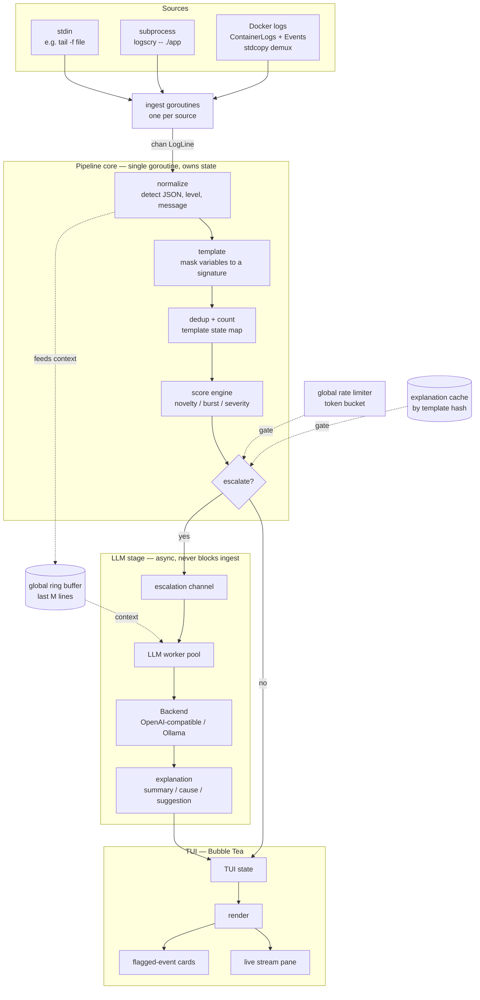

# RDI — `logscry` v1

> **What this document is.** A self-contained technical spec for the first shippable version of a real-time, AI-assisted log/event triage tool written in Go. It is written to be fed to an implementing assistant (in the same project) whose first job is to **scaffold a compiling repository skeleton** (milestone M0) — see the final section, *Instructions for the implementing assistant*.
>
> **Name** Final name is **`logscry`** — chosen and availability-checked: free on npm, no conflicting GitHub repo, and the module path `github.com/maxie7/logscry` is unused (your namespace). The name `triagent` is reserved for the future agentic mode (see section 10).

---

## 1. Purpose & positioning

A single-binary CLI/TUI tool that watches log/event streams **in real time** and uses an LLM to **explain only the events worth explaining** — surfacing genuine anomalies as they happen, while staying silent on routine noise.

It is **not** an "LLM observability" product (those monitor AI *applications* — prompts, tokens, output quality). It is the inverse: an LLM used as a tool to make *any* system's logs understandable.

**Differentiators (the lane this tool owns):**

1. **Real-time / streaming-native** — a live tail that flags anomalies as they appear, not a scan-on-demand report.
2. **Source-agnostic** — stdout/files and Docker containers in v1; NATS/Kafka/journald later. Not tied to Kubernetes.
3. **Dev-time, local, single binary** — point it at your running local stack while developing. No cluster, no SaaS, data can stay local.

**Closest comparable:** `k8sgpt` (Apache-2.0, CNCF sandbox, Go) validates demand for AI-explained errors but is **Kubernetes-specific** and **scan-based** (`k8sgpt analyze`). `logscry` deliberately takes the real-time + source-agnostic + dev-time lane it leaves open. Do **not** try to out-compete k8sgpt on Kubernetes.

**The moat (and the article material):** you cannot call an LLM on every log line in real time — cost, latency, noise. The interesting engineering is the pipeline that does cheap local pre-processing and escalates **only** novel/anomalous events to the LLM on a bounded token budget. Quality of that escalation decision is what makes the tool *impressive* rather than *annoying*.

---

## 2. v1 scope

**In scope:**

- Ingest logs from: (a) **stdin** (`tail -f x | logscry`), (b) **a subprocess** (`logscry -- ./myapp`, capturing stdout+stderr), (c) **Docker containers** (follow logs, auto-attach to new containers).
- Real-time processing pipeline: normalize → template (mask variable parts) → dedup/count.
- **Novelty/noise scoring engine** that decides which events escalate to the LLM, with a **global rate limiter** and an **explanation cache**.
- **Pluggable LLM backend**: OpenAI-compatible HTTP + Ollama (local) from day one. Async; never blocks ingestion.
- **TUI** (Bubble Tea): live stream pane + a pane of "flagged event" cards with the AI explanation, severity, count, first/last seen.
- Config via flags + optional config file + env (for API keys).
- Single static binary; cross-compiles for linux/macOS.

**Out of scope (explicitly NOT in v1 — defer to keep it finishable):**

- No database / persistence (in-memory only; an optional JSONL dump of flagged events is the most that's allowed).
- No web UI.
- No correlation across sources.
- No agentic / auto-investigation mode.
- No Kubernetes, NATS, or Kafka ingestion.
- No daemon/server mode, no alerting/webhooks.

These are the **Vision** (section 10), not v1.

---

## 3. Architecture



**Concurrency model.** One goroutine per source feeding a shared fan-in channel of `LogLine`. A single pipeline goroutine owns the template/state maps (no shared-mutex contention; state is goroutine-confined and updated via the channel). The LLM stage is a **small worker pool** consuming an *escalation* channel, so a slow/`down` model never blocks ingestion. **Backpressure:** bounded channels; if the escalation queue is full, coalesce or drop (never block the ingestion path). The TUI receives state updates over its own channel and never touches pipeline internals directly.

**Shared types** (in `internal/model`):

```go
type Stream int
const ( Stdout Stream = iota; Stderr )

type LogLine struct {
    Time   time.Time // parsed if available, else receipt time
    Source string    // e.g. "docker:api", "stdin", "proc:./myapp"
    Stream Stream
    Raw    string
    // filled by the pipeline:
    Level    string // "ERROR"/"WARN"/... if detected, else ""
    Message  string // message body after stripping structured prefixes
}

type Template struct {
    Hash      string    // signature of the masked line
    Pattern   string    // human-readable masked form, e.g. "user <NUM> failed"
    FirstSeen time.Time
    LastSeen  time.Time
    Count     int
    Recent    []time.Time // ring buffer of recent occurrences for burst detection
    Explained bool
    Explanation string   // last LLM explanation, if any
}
```

---

## 4. Ingestion spec

**stdin / subprocess** — trivial: read lines from `os.Stdin`, or run the target via `exec.Command` and read its `StdoutPipe`/`StderrPipe`. Tag `Stream` accordingly.

**Docker** — use the official Go SDK `github.com/docker/docker/client`.

- `ContainerLogs(ctx, id, container.LogsOptions{ShowStdout:true, ShowStderr:true, Follow:true, Timestamps:true, Tail:"100"})`.
- **Gotcha #1 (must handle):** if the container has **no TTY**, Docker multiplexes stdout+stderr into one stream with an 8-byte header per frame. Demultiplex with `stdcopy.StdCopy(stdoutW, stderrW, logsReader)` from `github.com/docker/docker/pkg/stdcopy`. If the container **has** a TTY, the stream is raw (single combined stream, no headers). Decide per container via `ContainerInspect` → `.Config.Tty`.
- **Gotcha #2:** with `Timestamps:true`, each line is prefixed with an RFC3339Nano timestamp — parse it; do **not** assume arrival order matches timestamp order across containers.
- **Auto-discovery:** subscribe to `client.Events(ctx, ...)` filtered on container `start`/`die` to attach/detach log followers automatically. This gives the "`docker compose up` and it just picks everything up" UX, which is also the demo.

Selection flags: `--docker-all`, `--docker-label k=v`, `--docker-name <regex>`, or explicit container IDs.

---

## 5. Processing & templating spec (`internal/pipeline`)

1. **Detect format:** if the line parses as JSON, extract `level`/`severity` and `msg`/`message`; otherwise treat as plain text and run light heuristics for a leading level token.
2. **Template (signature):** produce a masked form by replacing variable substrings with typed placeholders:
   - integers/floats → `<NUM>`
   - hex / UUIDs → `<HEX>` / `<UUID>`
   - IPv4/IPv6 → `<IP>`
   - quoted strings → `<STR>`
   - timestamps already stripped during ingestion
   - (file paths optional → `<PATH>`)
   So `user 4821 failed` and `user 9933 failed` collapse to `user <NUM> failed`. The template hash is the dedup key and the unit of "seen before vs new".
3. **Update template state:** upsert into `map[string]*Template`, bump `Count`, push to `Recent`, update `LastSeen`.

Implementation note: keep the masking regexes ordered and compiled once; expose them so they can be tuned later. Aim for "good enough to collapse noise", not perfect log parsing.

---

## 6. Novelty / noise scoring engine (`internal/score`) — the make-or-break

For each processed line, compute an escalation score from independent signals (tune weights via config; defaults below):

- **Novelty** — template never seen, or unseen for longer than `cooloff` (default 15m) → strong signal.
- **Burst** — a known template's `Recent` count within a sliding window (default 10s) exceeds an absolute threshold (default 50) **or** k× its established baseline rate → medium/strong.
- **Severity** — `Stream == Stderr` or `Level ∈ {ERROR, FATAL, PANIC, CRITICAL}` → additive weight.

**Escalate to the LLM iff:** `score ≥ threshold` **AND** not (`Explained` within cache TTL) **AND** the **global rate limiter** allows it.

- **Global rate limiter:** a token bucket (default `max N=10` LLM calls/min, configurable). This **caps cost regardless of log volume** — non-negotiable for v1.
- **Explanation cache:** keyed by template hash. A given error is explained **once**; subsequent occurrences just increment the count on the existing card (no new LLM call).

On escalation, assemble context for the LLM: the trigger line + the last `M` lines (default 30) from a **global ring buffer** (temporal context across all sources) + the template pattern + count/first-seen. Send to the escalation channel for the worker pool.

> The signal-to-noise quality of this module matters more than the prompt. A tool that cries wolf gets uninstalled after one day. Bias toward **fewer, higher-confidence** escalations in v1.

> **Calibration notes (post-v1).** The *signals* above are as shipped; several of their *weightings and thresholds* were corrected by running the tool against real systems, and `internal/score` is the source of truth for the numbers.
> - **Burst** has no absolute "N in the window" trigger (M4). A steady stream escalates at no rate whatsoever — "busy" is not "changed" — so only k× a template's own established baseline fires.
> - **Novelty** is a **booster, not a threshold-crosser** (v0.8.1, issue #27). It is weighted *below* the threshold, so a first-seen template escalates only in combination with severity or a burst. Four hours of a real laptop's journal produced 179 escalations in 2304 lines, almost all "novel template (first seen)": this section's assumption that new means suspicious holds for a stream with an established template set, but on a working host new-and-harmless is the steady state.
> - **Burst** additionally requires a **minimum absolute count in the window**, not the ratio alone (v0.8.3, issue #32). This is a gate and not the absolute trigger deleted above: it can only ever suppress. The baseline is a template's lifetime average, so one appearing every few minutes has a denominator near zero and any clustering of it yields an unbounded multiple — six hours of a real laptop's journal produced 16 burst escalations, none an incident, every one a cluster of ten or sixteen lines at 20×–340× baseline. Event-driven systems log in clusters by construction; ten lines in ten seconds is not a flood. At the default multiplier and window the gate is equivalent to distrusting any baseline below 0.5/s. It is a **workaround, not a fix**: the root cause is that `baseline()` never forgets, tracked as issue #37.
> - **"Explained once" is bounded by `cache_ttl`, and a second explanation is never a second card** (v0.8.4, issue #34). The cache bullet above is as shipped and the card sentence in it is now literally true, but the pair needs reading together. Once the TTL expires the cache stops suppressing, so a template that went quiet and came back **is** escalated again and **does** cost a second LLM call — deliberately, because an error returning an hour later is worth explaining afresh. What must not happen is a second card: the answer lands on the card that template already has, which gains a flag count, its live occurrence count and its live last-seen. A card is a **template**, never an escalation; the anomaly pane's title counts cards while the status bar's `esc` and the JSONL export count flags, and the two numbers are labelled for what they each are. A re-escalation also never blanks the answer a card is already showing — the previous one stays visible, marked as belonging to the earlier flag, while the new one is fetched, and survives the new one failing (§7).

---

## 7. LLM backend (`internal/llm`)

```go
type ExplainRequest struct {
    Trigger     LogLine
    Context     []string // recent surrounding lines
    Template    string
    Count       int
    FirstSeen   time.Time
}
type ExplainResponse struct {
    Summary     string   // one-line "what happened"
    LikelyCause string
    Suggestion  string   // what to check / try
}
type Backend interface {
    Explain(ctx context.Context, req ExplainRequest) (ExplainResponse, error)
    Name() string
}
```

**v1 implementation shortcut:** Ollama exposes an **OpenAI-compatible** endpoint, and so do OpenAI, Groq, etc. So a single `OpenAICompatible` backend with a configurable **base URL + model + API key** covers OpenAI, Groq, **and** local Ollama. Keep the `Backend` interface clean so a native Ollama client (or others) can be added later, but ship one configurable implementation in v1.

- Async only: consumed by a worker pool (default size 2). Failures degrade gracefully — log a one-line error, mark the card as "explanation unavailable", never crash the tail.
- Prompt: a tight system prompt instructing concise, structured output (summary / likely cause / suggestion); request JSON to fill `ExplainResponse`. Keep responses short to control tokens.
- **Optional/stretch (v1):** anonymization before sending to a remote backend (mask values, keep a reversible map to de-anonymize the response) — same idea as k8sgpt's masking. Mark as a flag, default off.

---

## 8. TUI (`internal/tui`)

- Framework: `github.com/charmbracelet/bubbletea` (+ `lipgloss` for styling, `bubbles` for viewport/list).
- Layout: **left** = live stream (option to show the *templated* view with per-template counters); **right** = scrollable list of **flagged-event cards**.
- Card fields: severity badge, the one-line `Summary`, `LikelyCause`, `Suggestion`, occurrence `Count`, `FirstSeen`/`LastSeen`, source.
- Keybindings: scroll, select a card to expand, pause/resume stream, quit. A non-TUI `--plain` mode (line output) is a nice-to-have for piping/CI.

---

## 9. Configuration

- Flags for everything common; `--config logscry.yaml` for the full set; env for secrets (`LOGSCRY_API_KEY`).
- Configurable: sources, LLM base URL/model/key, scoring weights + thresholds, rate-limit (calls/min), context window size, cooloff/burst windows.
- Sensible zero-config defaults so `logscry -- ./myapp` works out of the box against a local Ollama if one is running.

---

## 10. Vision (post-v1 — do not build now, but design seams for it)

- More sources: **NATS/Kafka** event streams, journald, Kubernetes.
- **Correlation** across sources ("error in A correlates with a queue-depth spike in B").
- **Agentic investigation mode**: on an anomaly, an agent autonomously pulls related streams, forms a hypothesis, proposes a fix (this is the headline for a later version and ties to an "agentic engineering" narrative).
- Optional persistence + daemon/operator mode + alerting.

Keep the `ingest` and `Backend` interfaces clean so these slot in without a rewrite.

---

## 11. Repository structure

```
logscry/
├── cmd/
│   └── logscry/
│       └── main.go            # flag parsing, wiring, graceful shutdown (context + signals)
├── internal/
│   ├── model/                 # LogLine, Template, shared types
│   ├── ingest/                # stdin.go, subprocess.go, docker.go (Source interface)
│   ├── pipeline/              # normalize.go, template.go, masking regexes
│   ├── score/                 # scoring signals, escalation decision, rate limiter, cache
│   ├── llm/                   # Backend interface, openai_compatible.go
│   ├── tui/                   # bubbletea program + views
│   └── config/                # config loading (flags/file/env)
├── examples/
│   └── demo/                  # docker-compose.yml + a tiny buggy service for the killer demo
├── go.mod
├── go.sum
├── Makefile                   # build, run, test, lint, cross-compile
├── README.md
├── LICENSE                    # Apache-2.0 (see decision below)
├── NOTICE                     # required by Apache-2.0
├── .gitignore                 # Go
└── .github/workflows/ci.yml   # build + go vet + golangci-lint + go test
```

Suggested `Source` interface in `internal/ingest`:

```go
type Source interface {
    // Lines emits LogLines until ctx is cancelled or the source ends.
    Lines(ctx context.Context, out chan<- model.LogLine) error
    Name() string
}
```

---

## 12. Tech stack

- **Go** 1.24+ (target the latest stable release; pin in `go.mod`).
- Docker SDK: `github.com/docker/docker/client` + `.../pkg/stdcopy`.
- TUI: `github.com/charmbracelet/bubbletea`, `github.com/charmbracelet/lipgloss`, `github.com/charmbracelet/bubbles`.
- HTTP for LLM: standard library `net/http` (no SDK needed for an OpenAI-compatible endpoint).
- Config/flags: stdlib `flag` is enough for v1; `spf13/cobra`+`viper` only if the surface grows.
- Lint: `golangci-lint`. Tests: stdlib `testing` (unit-test the templating and scoring engine — they're pure and high-value to test).

---

## 13. Milestones (also the private → public trigger)

| Milestone | Deliverable | Repo visibility |
|---|---|---|
| **M0** | Compiling skeleton: layout, `go mod init`, stubbed interfaces + `// TODO(Mn)` markers, `main` that reads stdin and prints, Makefile, CI, README/LICENSE/.gitignore. `make build` works. | private |
| **M1** | Ingestion: stdin + subprocess + Docker (with `stdcopy` demux + `Events` auto-attach). | private |
| **M2** | Pipeline: normalize + template + dedup; TUI shows live templated stream with counts. | private |
| **M3** | Scoring engine: novelty/burst/severity + escalation decision + rate limiter + cache. Unit-tested. | private |
| **M4** | LLM backend: OpenAI-compatible + Ollama; async explanations on escalated events. | private |
| **M5** | TUI polish: cards pane, expand/keybindings, `--plain` mode. | private |
| **M6** | `examples/demo` compose + README with usage + **demo GIF**. Clean up history if needed. | **→ flip to PUBLIC** |

---

## 14. Definition of done (v1)

- Single binary; `logscry -- ./app` and `logscry --docker-all` both work.
- Runs fully **offline** against a local Ollama model.
- **Killer demo passes:** with `examples/demo` running, hitting the failing endpoint makes a flagged card appear within a second or two ("panic: nil pointer in handler X — likely cause Y — check Z"); and crucially, **under normal traffic the tool stays quiet** (no cards, no LLM calls beyond the rate cap). The contrast *"silent on noise, speaks on a real problem"* is the thing that sells it.

---

## 15. License decision

**Apache-2.0.** Permissive (maximizes adoption for a showcase tool) plus an explicit patent grant; it's the cloud-native ecosystem norm (k8sgpt and most CNCF projects use it). Requires a `LICENSE` + `NOTICE` file and the standard header comment in source files.

Acceptable alternative: **MIT** (simpler, no `NOTICE`/headers) if minimal ceremony is preferred. Do **not** use AGPL unless the goal becomes open-core / preventing SaaS reuse.

---

## 16. Instructions for the implementing assistant

Your immediate task is **milestone M0 only: produce a compiling, runnable repository skeleton** — not the full logic.

1. Create the repo layout in section 11.
2. `go mod init github.com/maxie7/logscry`.
3. Define the shared types from section 3 in `internal/model`.
4. Stub each `internal/*` package with the **interfaces and function signatures** specified in this document, each body containing `// TODO(Mn): ...` referencing the relevant milestone from section 13.
5. Implement a **minimal end-to-end path** so the binary compiles and runs: `main.go` wires a stdin `Source` → pipeline pass-through → prints lines to stdout. Add context-based graceful shutdown on SIGINT/SIGTERM.
6. Add `Makefile` (`build`, `run`, `test`, `lint`, `cross` targets), `.github/workflows/ci.yml` (build + `go vet` + `golangci-lint` + `go test ./...`), a Go `.gitignore`, the **Apache-2.0** `LICENSE` + `NOTICE`, and a `README.md` skeleton containing: the positioning (section 1), a usage placeholder, and a "Demo (coming soon)" placeholder.
7. Confirm `make build` succeeds and `echo "hello" | ./bin/logscry` prints the line.

Do not implement ingestion, templating, scoring, the LLM backend, or the TUI yet — leave them as clearly-marked stubs aligned to the milestones. Keep the seams clean so M1–M5 can be added without restructuring.
